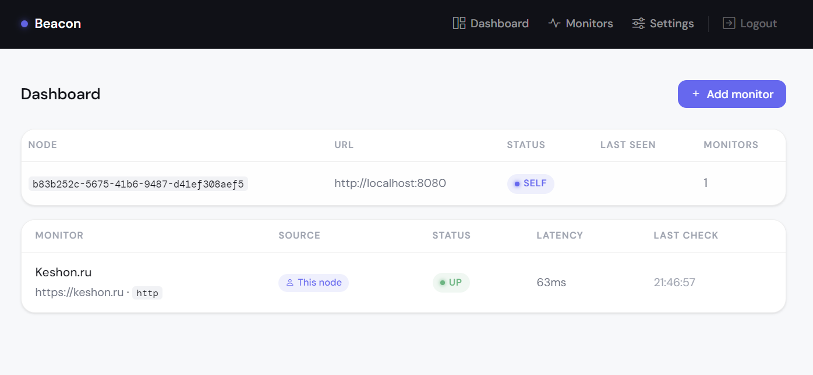

# Beacon

Vibecoded uptime monitor for HTTP and TCP endpoints. Checks targets on a schedule, sends alerts (Telegram, Discord) on down/recovery, and exposes a web dashboard. Supports a federated network: multiple instances can sync and back up each other when one fails.

Written in Go with few dependencies. Uses less memory than typical monitoring stacks.



## Run

```bash
go run ./cmd/beacon
```
